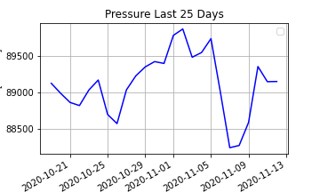
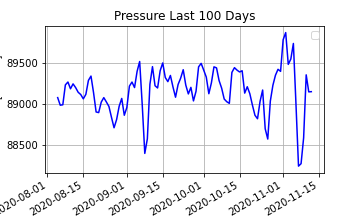

# Assignment 12
Diana Hsieh

HAS Tools
- - -
__
## Grade
3/3 - Nice work!  The units part on the regression models is a little tricky really we should be paying much more attention to normalization when we add all these things together.

__

# Summary of How I Made My Forecasts

I've given up entirely on my Linear Regression model. I am now looking into a crystal ball, astrological signs, and tea leaves.

Okay not really. I'm still looking back at the last weeks averages and now I'm just using that same percentage increase to predict next weeks flow. However I also looked at my new found pressure data and it looks like the pressure is stabilizing, so I didn't increase the flow that much.

## Assignment Questions

1) A description of the dataset you added
-  I added a NCEP dataset into my code. The parameter I chose was pressure. I downloaded data from the same timeline as the streamflow data and the bounding box you recommended.

2)What is the dataset? Why did you choose it?
- I used the daily mean of surface level pressure because I know pressure drops equal precipitation. I thought if we could see a drop in pressure we should definitely predict some increasing flow then.

3) What is the spatial and temporal resolution and extent of the data ?
- The spatial resolution is a single latitude and longitude point for each dataset (35.0, 247.5). The temporal resolution I downloaded was from 1989 onward, however I chose to use only the most recent 25-100 days of data.

3) Where did you get the data from?
- The data came from the Physical Science Laboratory Site. I downloaded NCEP Reanalysis Daily Averages and Pressure.

4) What was your approach to extracting and aggregating it into something useful to you?

- I initially tried to add my pressure data into my linear regression model. This of course led to an answer that was useless because the units of flow (cfs) and pressure (pascals) do not match. When I added pressure into the linear regression model I was getting a prediction of -600+ cfs. This makes sense because the pressure readings were all 80,000+ pascals, which skewed the data.
Ultimately I chose to look at pressure from the last 25 to 100 days. The last 100 days shows me what the pressure generally averages at. Then the last 25 days can show me the current trend.

5) A plot of the dataset you added. This can be a timeseries, map, histogram or any other plot that you think is a good summary of what you added.

PS, thank you for figuring out why my plots weren't plotting last time!!
