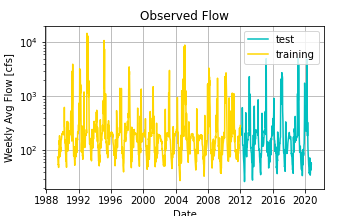
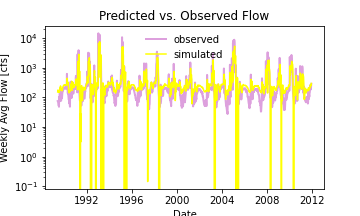

# Assignment 5
Diana Hsieh

HAS Tools

10/5/2020
- - -

## Summary of How I Made My Forecasts

I did **not** use my model I built to make my prediction, as it gave me a prediction of 160 cfs... something tells me that that isn't right.

Instead, I stuck with what I did last week- I calculated the historical mean flow in September (172.68 cfs) and the historical mean flow in October (146.16 cfs) and compared the two. I see that flow decreases in October so I used that to make predictions lower than September. I also looked at the mean flows for the past two weeks and used those means as a starting point for my predictions and made my second week predictions slightly lower than my first.

## Assignment Questions
*1. A summary of the AR model that you ended up building, including (1) what you are using as your prediction variables, (2) the final equation for your model and (3) what you used as your testing and training periods. In your discussion please include graphical outputs that support why you made the decisions you did with your model.*

(1) my prediction variables were 1-20, representing 20 weeks of previous time shifted data.

(2) This was the final output of my equation. The full equation is in my python script.

coefficient of determination: 0.4
intercept: 122.62
slope: [ 0.43  0.1  -0.    0.13  0.1   0.19 -0.12 -0.09 -0.02 -0.05 -0.03 -0.
  0.03  0.03  0.01  0.01 -0.01 -0.02 -0.    0.  ]

(3) I built an AR model using data from January 1st 1989 to present time. Originally I tried to do just over 3 years of data (2017 to present) and only from September to October but got a r2 of 0.15. Then I tried to do the whole data set with only the last 10 years of data (2010 onwards) but also got an r2 value of 0.10. So I decided to use the entire dataset and add more steps into the model (I did 20 steps). This increased my r2 to a whopping 0.40 and I concluded this was the best of the three tries so I would stick with it.

For my final model my training periods were rows 21-1200 (From May 28, 1989 to January 1, 2012), and my testing periods were rows 1200-finish (from January 8, 2012 to present).

*2. Provide an analysis of your final model performance. This should include at least one graph that shows the historical vs predicted streamflow and some discussion of qualitatively how you think your model is good or bad.*

There is definitely something off with my model. My model has slopes that are negative, which gives this graph, clearly incorrect.

I tried three different data sets to increase my r2. Two of the methods failed pretty impressively and the one I stuck with is just slightly better than your models r2 (more discussion above in question 1 part 3).

If I were to really try to make a model to predict flow, I wouldn't pick linear regression. I believe that is why my r2 is so poor, because flow throughout the year is not linear, but has seasonality with ebbs and flow.

*3. Finally, provide discussion on what you actually used for your forecast. Did you use your AR model, why or why not? If not how did you generate your forecast this week?*

No, definitely did not use my AR model. Discussion above in the "Summary of How I Made My Forecasts" section.
