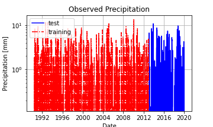

# Assignment 9
Diana Hsieh

HAS Tools

10/25 - 10/31
- - -
### Grade

3/3 - Nice job!

-- Also FYI I fixed your plot issue. The problem is that you can't have a space in your file name (or you need to use a \ to designate the space) I changed it to an '_' and it works. 

___

## Summary of How I Made My Forecasts

I used my function to calculate last weeks averages, but I also used 2018 and 2019 10/25-10/31 weekly averages to determine my predictions. I believe we will see an increase in flow (why, I have no idea) because the weekly averages was 97 and 161 the last two years. Since we're in a drought year I picked 90 cfs as my prediction and 95 for my second week.

## Assignment Questions

*What is a dataset? Why did you choose it?*

I chose to use precipitation data because I thought precipitation data would be the best to see flow increases and trends.

*What location have you chosen?*
I chose the very beginning of the Verde River (34.8559, -112.45172). I figured precipitation data from the start of the river would be a good indication of how much flow would increase by the USGS stream gauge.

*Where did you get the data from?*
I used DayMet, but this turned out to not work out for me. DayMet only had data up until 12/31/19, so I couldn't actually use it to predict next weeks flow.

*What was your approach to accessing it?*
I went to NOAA station mapper and located a stream gauge at the beginning of Verde River. I then used DayMet to download precipitation data.

Unsure why I can't put my image in here without dragging from my GUI. This doesn't work even though the file is in my assets folder?

