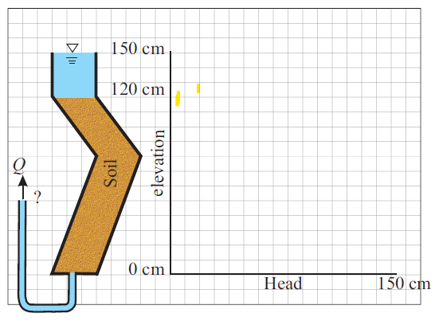

# Assignment 4
Diana Hsieh

HAS Tools

9/20/2020
- - -

I won the previous weeks prediction, therefore, I'm skipping my markdown for this week.

:tada::tada:

NOTE:
Below are all my attempts to add in a random picture. All failed. I know the path is correct and filename, so not sure how I would have added my histograms in my markdown file. 

